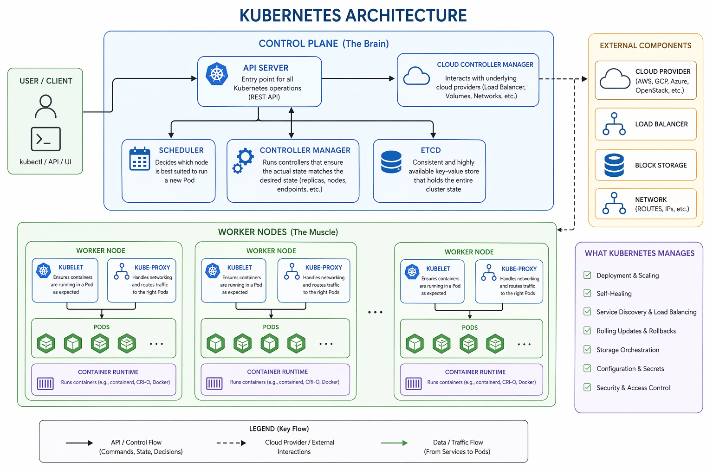

## Limitations of docker in production and why we need kubernetes ?

While Docker is a powerful tool for containerization, it has several limitations when it comes to production environments:
1. **Single Host Limitation**: Docker is primarily designed to run containers on a single host. In production, applications often need to be distributed across multiple hosts for scalability and high availability.
2. **No auto healing**: If a container crashes, Docker does not automatically restart it or replace it with a new instance.
2. **No auto scaling**: Docker does not have built-in capabilities to automatically scale containers up or down based on demand.
2. **Networking Complexity**: Docker's networking model can become complex in production environments, especially when dealing with multiple containers that need to communicate across different hosts.
3. **Storage Management**: Managing persistent storage for Docker containers can be challenging in production, particularly when containers need to share data or maintain state across restarts.
4. **Orchestration**: Docker lacks built-in orchestration capabilities, making it difficult to manage large-scale deployments, handle load balancing, and ensure fault tolerance without additional tools.
7. No api agateway: Docker does not provide a built-in API gateway to manage and route traffic to different services.
8. **Security Concerns**: Docker containers share the host OS kernel, which can lead to security vulnerabilities if not properly managed. In production, isolating workloads is crucial for security.
9. **No firewalling**: Docker does not provide built-in firewall capabilities to control traffic between containers or between containers and the outside world.
10. **No service discovery**: Docker does not have built-in service discovery mechanisms to help containers find and communicate with each other.


To address these limitations, production environments often use container orchestration platforms like Kubernetes, which provide features such as multi-host networking, storage management, auto-scaling, service discovery, and enhanced security measures.


Let’s break **Kubernetes Fundamentals** into something intuitive, not textbook-heavy. Think of Kubernetes as a **system that runs and manages your containers automatically**.

---

# 🧠 1. What is Kubernetes?

**Kubernetes** is a container orchestration platform.

In simple terms:

> You tell Kubernetes *what you want* (e.g., “run 3 instances of my app”), and it ensures that state is always maintained.

Instead of manually:

* starting containers
* restarting when they crash
* scaling up/down

Kubernetes does all of that for you.

---

# 🤔 2. Why Kubernetes? (vs Docker Compose)

### With Docker Compose:

* Good for **local development**
* Runs containers on **one machine**
* No auto-healing (if container dies → it’s gone)
* Limited scaling

---

### With Kubernetes:

* Runs across **multiple machines (cluster)**
* **Self-healing** → restarts failed containers
* **Auto-scaling**
* Load balancing
* Rolling updates (zero downtime deploys)

---

### Quick analogy:

* Docker Compose = managing a few workers in one room
* Kubernetes = managing a **distributed workforce across buildings**

---

# 🏗️ 3. Kubernetes Architecture



The schematic of Kubernetes architecture is as follows:

```
                +---------------------+
                |      Master Node    |
                |---------------------|
                |  API Server         |
                |  Scheduler          |
                |  etcd               |
                |  Controller Manager |
                |Cloud Controller Mgr |
                +---------------------+
                          |
        ---------------------------------------
        |                                     | 
+---------------------+           +---------------------+
|     Worker Node 1   |           |     Worker Node 2   |
|---------------------|           |---------------------|
|  Kubelet            |           |  Kubelet            |
|  Container Runtime  |           |  Container Runtime  |
|  Kube-Proxy         |           |  Kube-Proxy         |
|  Pods               |           |  Pods               |
+---------------------+           +---------------------+
```


A Kubernetes cluster has **two main parts**:

## 🔷 A. Control Plane (the brain)

This is where decisions are made.

### 1. API Server

* Entry point to Kubernetes
* You interact using `kubectl`
* All commands go through this

👉 Example:

```bash
kubectl apply -f app.yaml
```

---

### 2. Scheduler

* Decides **where to run your pods**
* Chooses the best node based on:

  * CPU
  * Memory
  * Constraints

---

### 3. Controller Manager

* Ensures desired state = actual state

👉 Example:

* You say: “I want 3 pods”
* Only 2 are running
* Controller creates 1 more

---

### 4. etcd

* Key-value database
* Stores entire cluster state

👉 Think:

> Kubernetes memory (source of truth)

---

### 5. Cloud Controller Manager (if on cloud)
* Manages cloud-specific resources
* This Connects Kubernetes to cloud provider APIs like:
   
  * AWS
  * GCP
  * Azure

## 🔶 B. Worker Nodes (the muscle)

These actually run your applications.

---

### 1. kubelet

* Agent running on each node
* Talks to Control Plane
* Ensures containers are running

---

### 2. kube-proxy

* Handles networking
* Routes traffic to correct pods

---

### 3. Container Runtime(Actual Engine 🚀)
* Runs containers (e.g., Docker, containerd)
* Manages container lifecycle

Examples:

* containerd (default now)
* CRI-O

👉 Important: Kubernetes DOES NOT run containers directly
It uses container runtimes to do that.

# 🧱 4. Cluster Concepts

Now the most important building blocks 👇

---

## 🔹 Node

* A machine (VM or physical)
* Runs your workloads

👉 Types:

* Control Plane Node
* Worker Node

---

## 🔹 Pod (⚠️ MOST IMPORTANT CONCEPT)

Smallest unit in Kubernetes.

* Wraps one or more containers
* Containers in a pod share:

  * Network (same IP)
  * Storage

👉 Example:

* 1 pod = 1 app container
* OR
* 1 pod = app + sidecar container (like logging)

---

## 🔹 Namespace

Used to **organize resources** inside a cluster.

👉 Why?

* Separate environments
* Multi-team usage

---

### Example:

* `dev` namespace
* `prod` namespace
* `airflow` namespace

---

# 🔁 Putting It All Together

Let’s say you deploy an app:

1. You send request to **API Server**
2. It stores config in **etcd**
3. **Scheduler** picks a node
4. **kubelet** starts the pod on that node
5. **Controller** keeps checking:

   * If pod crashes → restart
6. **kube-proxy** ensures traffic reaches your app

---

# 🧠 One Powerful Mental Model

Think of Kubernetes like:

| Role              | Real World      |
| ----------------- | --------------- |
| API Server        | Manager         |
| Scheduler         | Planner         |
| Controller        | Auditor         |
| kubelet           | Worker          |
| Container Runtime | Machine         |
| etcd              | Brain           |
| Cloud Controller  | External vendor |

---

# 🧩 Real-World Mapping (If you’re an Airflow user)


* Each Airflow component (webserver, scheduler, workers) → runs as **Pods**
* Kubernetes ensures:

  * Workers auto-scale
  * Failed tasks get new pods
  * Isolation between teams using **Namespaces**

---

# ⚡ One-line Summary

> Kubernetes = “Desired state engine for running containers reliably at scale”

---
