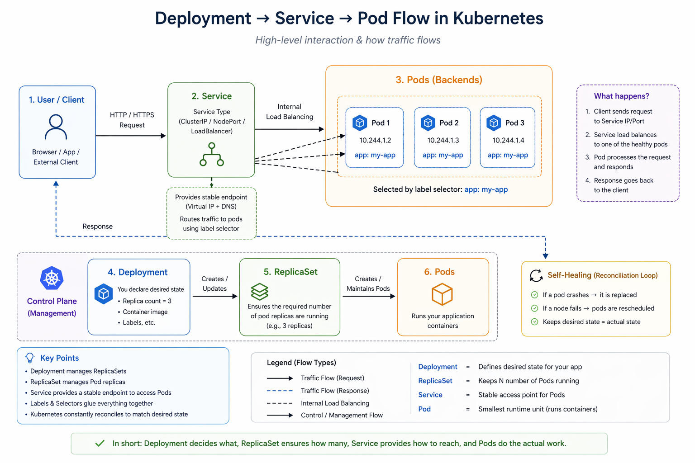

Good — this is the **heart of Kubernetes**. Let's discuss **what you actually use daily**.

I’ll explain this like how things behave in real systems (not just definitions).

---

# 🧱 Core Objects (Deep Dive)

---

# 🔹 1. Pods (⚠️ Most Important Concept)

## 👉 What is a Pod?

A **Pod** is the **smallest deployable unit** in Kubernetes.

* It wraps **one or more containers**
* All containers inside share:

  * Same IP
  * Same network namespace
  * Shared storage (optional)

---

## 🧠 Mental Model

> Pod = “A running instance of your application”

---

## 📦 Example (Single Container Pod)

```yaml
apiVersion: v1
kind: Pod
metadata:
  name: my-app
spec:
  containers:
    - name: app
      image: nginx
```

---

## 🔄 Pod Lifecycle

A Pod goes through these phases:

1. **Pending**

   * Pod created, not scheduled yet

2. **Running**

   * Container is running

3. **Succeeded**

   * Completed successfully (for jobs)

4. **Failed**

   * Something went wrong

5. **CrashLoopBackOff**

   * Keeps crashing repeatedly

---

## ⚠️ Important Truth

> Pods are **ephemeral** (temporary)

* If a Pod dies → it is NOT repaired
* It is **recreated**

---

## 🔁 Multi-Container Pods (Sidecar Pattern)

Sometimes a Pod has multiple containers:

### Example:

* Main app container
* Logging container
* Monitoring agent

```yaml
containers:
  - name: app
    image: my-app
  - name: logger
    image: fluentd
```

👉 Both run together like a **team in one box**

---

## When to use multi-container pods?

* Logging sidecars
* Proxy (e.g., Envoy)
* Data sync containers

---

# 🔹 2. ReplicaSet

## 👉 What is it?

Ensures **a fixed number of Pods are always running**

---

## Example:

> “I want 3 replicas of my app”

If:

* 1 pod crashes → it creates another
* Node dies → pods get recreated elsewhere

---

## YAML Example:

```yaml
kind: ReplicaSet
spec:
  replicas: 3
```

---

## ⚠️ Reality Check

You usually **don’t use ReplicaSet directly**

👉 Instead, you use **Deployments** (which manage ReplicaSets)

---

# 🔹 3. Deployments (🚀 Most Used Object)

## 👉 What is it?

A **Deployment** manages:

* ReplicaSets
* Updates
* Rollbacks

---

## 🧠 Mental Model

> Deployment = “Smart manager for your app”

---

## Example:

```yaml
kind: Deployment
spec:
  replicas: 3
  template:
    spec:
      containers:
        - image: my-app:v1
```

---

## 🔄 Rolling Updates (Zero Downtime)

When you update:

```yaml
image: my-app:v2
```

Kubernetes:

1. Creates new Pods (v2)
2. Gradually removes old Pods (v1)

👉 No downtime

---

## 🔙 Rollbacks

If something breaks:

```bash
kubectl rollout undo deployment my-app
```

👉 Instantly revert to previous version

---

## 🔥 Real Insight

> Deployment = version control + scaling + healing combined

---

# 🔹 4. Services (Networking Layer)

Pods are **dynamic**:

* They die
* IP changes

👉 So you cannot directly connect to Pods

---

## Solution → **Service**

> Service = stable access to Pods

---

## 🧩 Types of Services

---

## 🔸 A. ClusterIP (Default)

* Internal access only
* Used **inside cluster**

---

### Example:

* Backend talks to DB
* Microservices communication

👉 Only accessible within cluster

---

## 🔸 B. NodePort

* Exposes service on each node

Example:

```
NodeIP:30007
```

---

👉 You can access from outside

But:

* Not production-friendly
* Ports are limited

---

## 🔸 C. LoadBalancer (Cloud Use)

* Creates cloud load balancer
* Exposes app to internet

---

👉 Example:

* AWS ELB
* Azure LB

---

## Flow:

```
User → LoadBalancer → Service → Pods
```

---

# 🔹 5. Labels & Selectors (Glue of Kubernetes)

This is how everything connects.

---

## 👉 Labels

Key-value pairs attached to objects

```yaml
labels:
  app: my-app
  env: prod
```

---

## 👉 Selectors

Used to **find matching objects**

---

## Example:

### Deployment:

```yaml
labels:
  app: my-app
```

### Service:

```yaml
selector:
  app: my-app
```

👉 Service will route traffic to those Pods

---

## 🧠 Mental Model

> Labels = tags
> Selectors = filters

---

# 🔁 Putting Everything Together

Let’s say you deploy an app:

1. **Deployment**

   * Manages app lifecycle

2. **ReplicaSet**

   * Ensures 3 pods always running

3. **Pods**

   * Run your containers

4. **Service**

   * Exposes Pods

5. **Labels**

   * Connect Service ↔ Pods

---

# 🔥 Real-World Example (Very Important)



```
Deployment (3 replicas)
        ↓
   ReplicaSet
        ↓
   Pods (3)
        ↓
 Service (ClusterIP / LB)
        ↓
      Users
```

---

# ⚡ Common Beginner Mistakes

❌ Creating Pods directly
👉 Use Deployment

❌ Exposing Pods directly
👉 Use Service

❌ Ignoring labels
👉 Everything breaks without labels

---

# 🧠 One-Line Summary

> Pods run apps, ReplicaSets keep them alive, Deployments manage them, Services expose them, Labels connect everything.

---
