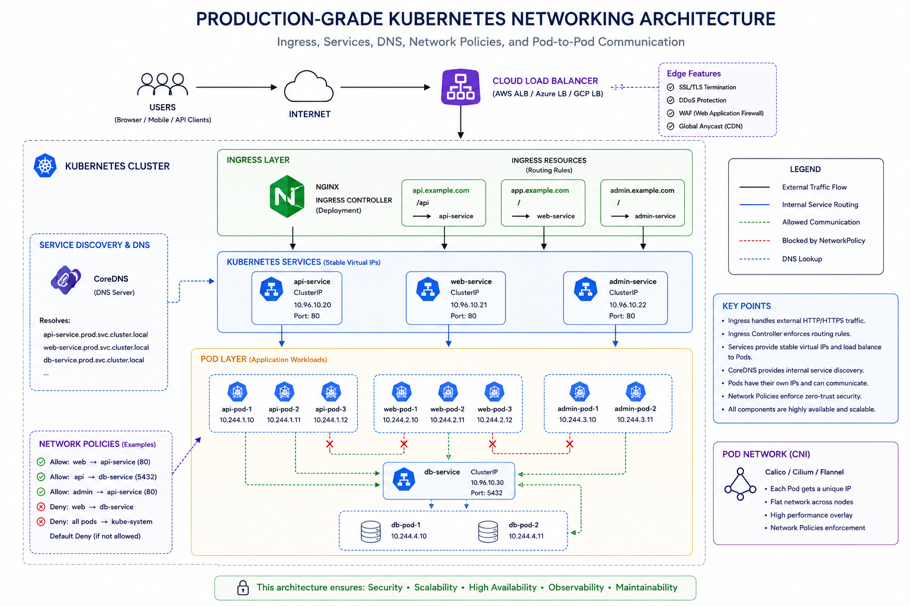

Phase 4 is where Kubernetes becomes a **distributed system platform**.

This is one of the hardest topics because multiple layers interact:

* Pods
* Services
* DNS
* Ingress
* Load balancers
* Network policies

Let’s build this step-by-step like a real production system.

---

# 🌐 PHASE 4: Kubernetes Networking

---

# 🧠 Big Picture

Imagine you deployed:

* frontend
* backend
* database

Questions arise:

* How do pods talk to each other?
* How does frontend find backend?
* How do users access app from internet?
* How do we secure communication?

👉 Kubernetes networking solves all this.

---

# 🧱 1. Kubernetes Networking Model

This is the **foundation**.

---

# 🔥 Core Kubernetes Networking Rules

Kubernetes has a very important design principle:

---

## ✅ Rule 1:

> Every Pod gets its own IP address

Unlike Docker bridge networking:

* Pods are NOT NATed behind host IP
* Pods communicate directly

---

## ✅ Rule 2:

> Pods can communicate with all other pods

By default:

* No firewall restrictions
* Full cluster communication

---

## ✅ Rule 3:

> Containers inside a Pod share network namespace

Meaning:

* Same IP
* Same localhost

---

# 🧠 Mental Model

```
Pod A (10.0.0.5)
Pod B (10.0.0.8)

Direct communication possible
```

---

# 🔥 Important Insight

Pods are:

* Dynamic
* Temporary
* IPs change constantly

👉 So you SHOULD NOT directly connect to Pod IPs

---

# 🔹 How Kubernetes Networking Actually Works

Kubernetes uses:

* CNI plugins (Container Network Interface)

Examples:

* Calico
* Flannel
* Cilium
* Azure CNI

These provide:

* Pod IP allocation
* Routing
* Overlay networking

---

# 🧩 Real-World Flow

```
Node 1
 └── Pod A (10.0.0.5)

Node 2
 └── Pod B (10.0.1.7)

CNI routes traffic between them
```

---

# 🌐 2. Service Discovery & DNS

Now the big problem:

👉 Pods die
👉 Pod IP changes

How do apps reliably find each other?

---

# 🔹 Solution → Services + DNS

---

# 🧠 Service Discovery

Kubernetes automatically creates stable DNS names for Services.

---

# Example

Service:

```yaml
name: user-service
namespace: prod
```

DNS becomes:

```text
user-service.prod.svc.cluster.local
```

---

# 🔥 Real Use

Backend app connects like:

```python
DB_HOST=user-service
```

NOT:

```python
DB_HOST=10.0.0.5
```

---

# 🧠 Why this matters

Pods can:

* restart
* scale
* move nodes

BUT:
👉 Service DNS remains stable

---

# 🔹 CoreDNS

This is the DNS server inside Kubernetes cluster.

It:

* Resolves service names
* Maps them to service IPs

---

# 🧪 Example

Inside pod:

```bash
nslookup user-service
```

Returns:

```
10.96.120.15
```

(Service ClusterIP)

---

# 🌍 3. Ingress (External HTTP Routing)

Now another problem:

---

## Without Ingress

If you expose 10 apps:

* Need 10 LoadBalancers
* Expensive
* Hard to manage

---

# 🔹 What is Ingress?

Ingress is:

> HTTP/HTTPS routing layer into cluster

---

# 🧠 Mental Model

Ingress acts like:

* Reverse proxy
* Traffic router

Similar to:

* NGINX
* Apache
* HAProxy

---

# 🧩 Example

```
api.example.com → backend-service
shop.example.com → shop-service
```

---

# 🔥 Key Insight

Ingress is ONLY:

* A set of routing rules

It DOES NOT process traffic itself.

---

# 🌐 4. Ingress Controller (VERY IMPORTANT)

This is what beginners usually miss.

---

# 🔹 What is it?

Ingress Controller is the actual software implementing ingress rules.

Examples:

* NGINX Ingress Controller
* Traefik
* HAProxy
* AWS ALB Controller

---

# 🧠 Relationship

| Component          | Role                   |
| ------------------ | ---------------------- |
| Ingress            | Rules                  |
| Ingress Controller | Actual traffic handler |

---

# 🧩 Flow

```
Internet
    ↓
LoadBalancer
    ↓
NGINX Ingress Controller
    ↓
Ingress Rules
    ↓
Services
    ↓
Pods
```

---

# 🧪 Real Example

## Ingress YAML

```yaml
apiVersion: networking.k8s.io/v1
kind: Ingress
metadata:
  name: app-ingress
spec:
  rules:
    - host: api.example.com
      http:
        paths:
          - path: /
            pathType: Prefix
            backend:
              service:
                name: user-service
                port:
                  number: 80
```

---

# 🔥 What happens?

Request:

```
https://api.example.com
```

Flow:

```
Ingress Controller → user-service → pods
```

---

# 🔐 Ingress also handles:

* SSL/TLS termination
* Path routing
* Host routing

---

# 🔥 Real Production Example

```
/api → backend-service
/auth → auth-service
/airflow → airflow-webserver
```

All behind ONE load balancer.

---

# 🛡️ 5. Network Policies

Now security.

By default:

> Every pod can talk to every pod

This is dangerous.

---

# 🔹 What are Network Policies?

Firewall rules for Pods.

---

# 🧠 Mental Model

> NetworkPolicy = Kubernetes firewall

---

# 🧪 Example

Allow only frontend → backend:

```yaml
kind: NetworkPolicy
spec:
  podSelector:
    matchLabels:
      app: backend

  ingress:
    - from:
        - podSelector:
            matchLabels:
              app: frontend
```

---

# 🔥 Result

✅ frontend → backend allowed
❌ other pods blocked

---

# ⚠️ Important

Network Policies work ONLY if:

* CNI supports them

Examples:
✅ Calico
✅ Cilium
❌ Basic Flannel

---

# 🧩 Real-World Architecture

Here’s how everything fits together:

```
                    INTERNET
                        │
                        ▼
               Cloud Load Balancer
                        │
                        ▼
          NGINX Ingress Controller
                        │
                        ▼
                   Ingress Rules
              ┌─────────┴─────────┐
              ▼                   ▼
        frontend-service    api-service
              │                   │
              ▼                   ▼
           Frontend Pods      Backend Pods
                                      │
                                      ▼
                                db-service
                                      │
                                      ▼
                                  DB Pods
```

---

# 🔥 Real Production Flow

User opens:

```
https://api.example.com
```

---

Flow:

1. DNS resolves domain
2. LB receives traffic
3. Ingress Controller handles request
4. Ingress rule matches host/path
5. Routes to Service
6. Service load-balances to Pods

---

# ⚡ Common Beginner Mistakes

---

## ❌ Directly exposing Pods

👉 Use Services

---

## ❌ Thinking Ingress = LoadBalancer

👉 Ingress is only routing rules

---

## ❌ No Network Policies

👉 Security nightmare

---

## ❌ Hardcoding Pod IPs

👉 Pods are ephemeral

---

# 🧠 One-Line Summary

| Component          | Purpose                  |
| ------------------ | ------------------------ |
| Service            | Stable internal access   |
| DNS                | Find services            |
| Ingress            | External HTTP routing    |
| Ingress Controller | Implements ingress       |
| NetworkPolicy      | Secure pod communication |

---

# 🧠 Ultimate Mental Model

```
Pods = workloads
Services = stable networking
DNS = service discovery
Ingress = external routing
NetworkPolicy = security firewall
```

---

The networking architecture of kubernetes in the image below:
