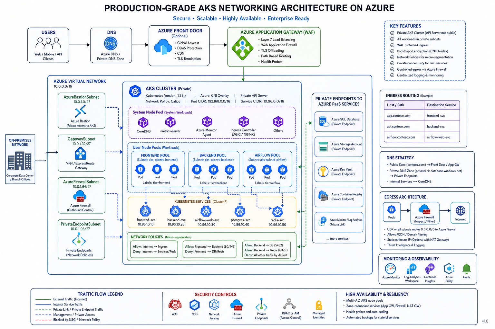

Now we’re entering **real production Kubernetes engineering**.

AKS networking is one of the most important topics in cloud Kubernetes because networking impacts:

* Security
* Scalability
* Performance
* Cost
* Connectivity with enterprise systems

Let’s build this from ground-up using a **real-world production architecture mindset**.

---

# ☁️ AKS Networking in Production

---

# 🧠 Big Picture

Imagine your company runs:

* Frontend web app
* Backend APIs
* Airflow
* PostgreSQL
* Internal enterprise systems

Requirements:

* Public access for frontend
* Private access for APIs
* Secure pod-to-pod communication
* Connectivity to databases
* Corporate network integration
* Internet egress control

AKS networking solves all this.

---

# 🏗️ High-Level Production Architecture

```text
Internet
    │
    ▼
Azure Front Door / Application Gateway (WAF)
    │
    ▼
NGINX Ingress Controller OR AGIC
    │
    ▼
AKS Cluster
 ├── Frontend Pods
 ├── Backend Pods
 ├── Airflow Pods
 └── Internal Services
    │
    ▼
Azure Database / Redis / Storage
```

---

# 🔹 1. AKS Networking Fundamentals

AKS networking mainly involves:

| Layer            | Purpose                |
| ---------------- | ---------------------- |
| VNet             | Cluster network        |
| Subnets          | Isolate workloads      |
| CNI              | Pod networking         |
| NSG              | Firewall               |
| Ingress          | External routing       |
| Load Balancer    | Public/private traffic |
| DNS              | Service discovery      |
| Network Policies | Pod security           |

---

# 🌐 2. Virtual Network (VNet)

## 👉 What is it?

Azure Virtual Network is:

> Private network for your AKS cluster

Equivalent to:

* AWS VPC
* GCP VPC

---

# 🧠 Real Production Setup

```text
VNet: prod-vnet
  ├── aks-subnet
  ├── db-subnet
  ├── appgw-subnet
  └── private-endpoint-subnet
```

---

# 🔥 Why separate subnets?

Security + traffic isolation.

---

# 🔹 Example

| Subnet                  | Purpose                |
| ----------------------- | ---------------------- |
| aks-subnet              | AKS nodes/pods         |
| db-subnet               | Databases              |
| appgw-subnet            | Application Gateway    |
| private-endpoint-subnet | PaaS private endpoints |

---

# 🔹 3. Azure CNI (VERY IMPORTANT)

This is one of the biggest AKS topics.

---

# 🧠 What is CNI?

CNI = Container Network Interface

It controls:

* Pod IP assignment
* Routing
* Connectivity

---

# AKS supports multiple networking modes:

| Mode                 | Usage                       |
| -------------------- | --------------------------- |
| Azure CNI Overlay    | Recommended modern approach |
| Azure CNI Pod Subnet | Enterprise networking       |
| Kubenet              | Older/simple                |

---

# 🚀 Recommended Today

> Azure CNI Overlay

---

# 🔥 Azure CNI Overlay Architecture

## How it works

### Nodes:

* Get IPs from VNet subnet

### Pods:

* Get IPs from overlay CIDR

---

# 🧩 Example

```text
VNet: 10.0.0.0/16

Node subnet:
10.0.1.0/24

Pod CIDR:
192.168.0.0/16
```

---

# 🔥 Benefits

✅ Conserves VNet IPs

✅ Scales better

✅ Easier enterprise networking

✅ Recommended by Azure now

---

# ⚠️ Traditional Azure CNI Problem

Older Azure CNI:

* Every pod consumed VNet IP
* Large clusters exhausted subnet IPs quickly

---

# 🌍 4. Ingress in AKS Production

There are two common approaches:

---

# Option 1️⃣ NGINX Ingress Controller

Most common.

Flow:

```text
Internet
   ↓
Azure Load Balancer
   ↓
NGINX Ingress Controller
   ↓
Services
   ↓
Pods
```

---

# Benefits

✅ Flexible

✅ Kubernetes-native

✅ Multi-cloud compatible

---

# Option 2️⃣ AGIC (Application Gateway Ingress Controller)

Azure-native approach.

---

# Flow

```text
Internet
   ↓
Azure Application Gateway (WAF)
   ↓
AGIC
   ↓
AKS Services
   ↓
Pods
```

---

# 🔥 Benefits

✅ WAF built-in

✅ Azure-native

✅ Layer 7 routing

✅ SSL offloading

✅ Better enterprise integration

---

# 🧠 Production Recommendation

| Scenario                 | Recommended |
| ------------------------ | ----------- |
| Cloud-native portability | NGINX       |
| Azure enterprise         | AGIC        |

---

# 🔐 5. NSG (Network Security Groups)

Azure-level firewall.

Controls:

* Inbound traffic
* Outbound traffic

---

# Example

Allow:

```text
443 from Internet → App Gateway
```

Deny:

```text
Direct internet → AKS nodes
```

---

# 🔥 Best Practice

NEVER expose worker nodes publicly.

---

# 🛡️ 6. Kubernetes Network Policies

This is INSIDE cluster security.

---

# Example

Allow:

```text
frontend → backend
```

Deny:

```text
frontend → database
```

---

# Important:

AKS commonly uses:

* Calico
* Azure Network Policy Manager

---

# 🌐 7. Internal vs External Services

---

# 🔹 Internal Service

```yaml
type: ClusterIP
```

Only accessible inside cluster.

Use for:

* APIs
* DB communication
* Airflow internal services

---

# 🔹 External Service

```yaml
type: LoadBalancer
```

Creates Azure Load Balancer.

---

# 🧠 Production Insight

Avoid exposing every service publicly.

Instead:

```text
Internet
   ↓
Ingress
   ↓
Internal ClusterIP services
```

---

# 🔒 8. Private AKS Cluster (Production Standard)

---

# Public AKS Problem

API server accessible over internet.

---

# Production Setup

Use:

> Private AKS Cluster

---

# Result

```text
Developer VPN/Bastion
        ↓
Private API Server
```

No public API exposure.

---

# 🔥 Production-grade security baseline

✅ Private cluster
✅ Private endpoints
✅ WAF
✅ NSG
✅ Network policies

---

# 🌍 9. Egress Traffic Control

Important enterprise topic.

---

# Problem

Pods accessing internet directly:

* Security risk
* Compliance issue

---

# Solution

Use:

* Azure Firewall
* NAT Gateway
* UDR (User Defined Routes)

---

# Flow

```text
Pods
   ↓
Azure Firewall
   ↓
Internet
```

---

# Benefits

✅ Traffic inspection
✅ Static outbound IP
✅ Logging
✅ Compliance

---

# 🔐 10. Private Endpoints (Very Important)

Connect AKS privately to Azure services.

---

# Example

AKS → Azure SQL

Without Private Endpoint:

```text
Traffic over public internet
```

With Private Endpoint:

```text
Traffic stays inside VNet
```

---

# 🔥 Real Production Setup

```text
AKS
 ├── Airflow
 ├── APIs
 └── ML workloads

Connected privately to:
 ├── Azure SQL
 ├── Key Vault
 ├── Storage Account
 └── Redis
```

---

# 📡 11. DNS in AKS

Inside cluster:

* CoreDNS

Enterprise:

* Azure Private DNS Zones

---

# Example

```text
db.internal.company.local
```

Resolved privately inside VNet.

---

# 🔥 12. Real Production Architecture

---

```text
                    INTERNET
                        │
                        ▼
          Azure Front Door / CDN
                        │
                        ▼
        Azure Application Gateway (WAF)
                        │
                        ▼
                 AGIC / NGINX
                        │
        ┌───────────────┴───────────────┐
        ▼                               ▼
   frontend-service               api-service
        │                               │
        ▼                               ▼
   Frontend Pods                   Backend Pods
                                            │
                                            ▼
                                      Airflow Services
                                            │
                                            ▼
                                Azure SQL / Redis / Blob
                                   (Private Endpoints)

Outbound Traffic:
Pods → Azure Firewall → Internet
```

---

# ⚡ Production Best Practices

---

## ✅ Use Azure CNI Overlay

Modern scalable networking.

---

## ✅ Use Private AKS Cluster

No public API server.

---

## ✅ Use WAF

Protect ingress traffic.

---

## ✅ Use Internal ClusterIP services

Expose only ingress.

---

## ✅ Use Network Policies

Zero-trust networking.

---

## ✅ Use Private Endpoints

Avoid public cloud service exposure.

---

# 🧠 Final Mental Model

| Layer           | Responsibility         |
| --------------- | ---------------------- |
| VNet            | Network foundation     |
| CNI             | Pod networking         |
| Service         | Internal communication |
| Ingress         | External routing       |
| NSG             | Azure firewall         |
| NetworkPolicy   | Pod firewall           |
| App Gateway/WAF | Edge security          |
| Firewall/NAT    | Controlled egress      |

---

# 🔥 One-Line Summary

> Production AKS networking is about securely connecting pods, services, users, and cloud resources while controlling ingress, egress, identity, and isolation.

---

The architecture diagram could be as in the below diagram:


