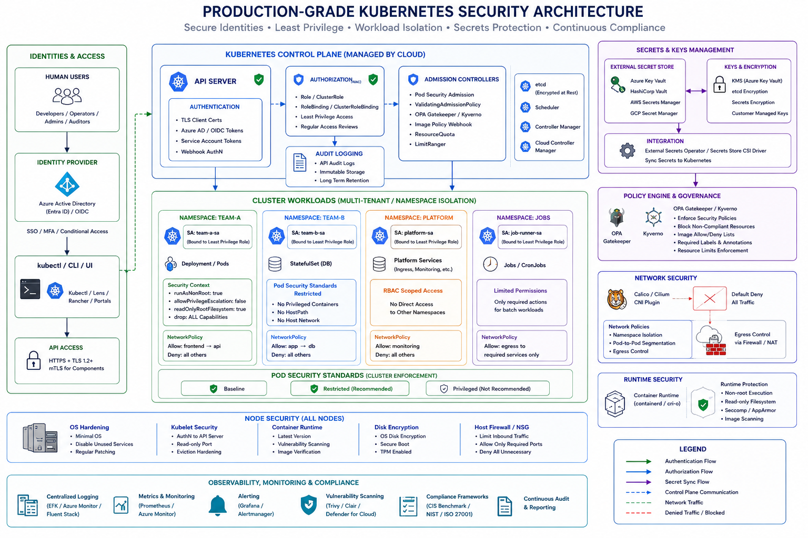

Security/RBAC is one of the most important phases in Kubernetes because:

> Kubernetes is fundamentally a distributed API system.

Security in Kubernetes is about answering:

```text id="j6wryr"
WHO can access?
WHAT can they access?
HOW are workloads isolated?
HOW are secrets protected?
```

This phase is the foundation for:

* Enterprise Kubernetes
* Multi-tenant systems
* Production AKS/EKS/GKE
* Airflow multi-org RBAC
* Secure CI/CD

---

# 🔐 PHASE 6: Kubernetes Security

---

# 🧠 Big Picture

Kubernetes security has multiple layers:

```text id="s0r8qb"
User Security
    ↓
API Security
    ↓
Cluster Authorization
    ↓
Workload Identity
    ↓
Pod Security
    ↓
Secrets Protection
    ↓
Network Security
```

---

# 🔹 1. Authentication vs Authorization

This is the FIRST thing to understand.

---

# 🧠 Authentication

Authentication answers:

> “Who are you?”

Examples:

* User
* Service account
* CI/CD pipeline

---

# 🧠 Authorization

Authorization answers:

> “What are you allowed to do?”

Examples:

* Can read pods?
* Can delete deployments?
* Can create secrets?

---

# 🔥 Kubernetes Security Flow

```text id="i7lfh8"
User/API Client
      │
      ▼
Authentication
(Who are you?)
      │
      ▼
Authorization
(What can you do?)
      │
      ▼
Admission Controllers
(Security policies)
      │
      ▼
Kubernetes API Server
```

---

# 🔹 2. Authentication in Kubernetes

Kubernetes supports multiple authentication methods.

---

# Common Authentication Types

| Method          | Usage            |
| --------------- | ---------------- |
| Certificates    | Admin access     |
| Tokens          | Service accounts |
| OIDC/Azure AD   | Enterprise login |
| IAM Integration | Cloud providers  |

---

# 🧠 Real Production Example (AKS)

```text id="ag3m0d"
Engineer logs in via Azure AD
        ↓
AKS validates identity
        ↓
RBAC permissions checked
```

---

# 🔥 Important Insight

Kubernetes itself does NOT manage users well.

In production:

* Use Azure AD
* Okta
* OIDC providers

---

# 🔹 3. RBAC (Role-Based Access Control)

This is the core Kubernetes authorization system.

---

# 🧠 What is RBAC?

RBAC defines:

> Who can do what on which resources

---

# 🧩 RBAC Components

| Component          | Purpose                  |
| ------------------ | ------------------------ |
| Role               | Permissions              |
| ClusterRole        | Cluster-wide permissions |
| RoleBinding        | Attach role to user      |
| ClusterRoleBinding | Cluster-wide attachment  |

---

# 🔥 Mental Model

```text id="jlwm0j"
Role = job description
RoleBinding = assigning employee to role
```

---

# 🔹 Role Example

```yaml id="g0tjj0"
kind: Role
metadata:
  namespace: dev
  name: pod-reader

rules:
- apiGroups: [""]
  resources: ["pods"]
  verbs: ["get", "list", "watch"]
```

---

# 🧠 Meaning

Can:
✅ get pods
✅ list pods
✅ watch pods

Cannot:
❌ delete pods
❌ create deployments

---

# 🔹 RoleBinding Example

```yaml id="b8kwwm"
kind: RoleBinding
metadata:
  name: read-pods

subjects:
- kind: User
  name: shreyas

roleRef:
  kind: Role
  name: pod-reader
```

---

# 🔥 Flow

```text id="8f4l61"
User: shreyas
      ↓
RoleBinding
      ↓
Role: pod-reader
      ↓
Can read pods only
```

---

# 🔹 ClusterRole

Role:

* Namespace scoped

ClusterRole:

* Entire cluster

---

# Example Uses

| Use Case                   | Object      |
| -------------------------- | ----------- |
| Read pods in one namespace | Role        |
| Read nodes cluster-wide    | ClusterRole |

---

# ⚠️ Dangerous Permission

```yaml id="1l62xt"
verbs: ["*"]
resources: ["*"]
```

Equivalent to:

> Kubernetes admin/root access

---

# 🔥 Production Best Practice

Use:

> Least Privilege Principle

Only minimum permissions.

---

# 🔹 4. Service Accounts

VERY IMPORTANT.

---

# 🧠 What is a Service Account?

Identity for Pods.

---

# Important Insight

Humans use:

```text id="d9j4fy"
Users
```

Applications use:

```text id="84v72s"
Service Accounts
```

---

# 🧪 Example

Your Airflow pod:

* needs to create jobs
* read secrets
* trigger workflows

It uses:

> ServiceAccount

---

# 🧪 Example YAML

```yaml id="8lc5bd"
apiVersion: v1
kind: ServiceAccount
metadata:
  name: airflow-sa
```

---

# Attach to Pod

```yaml id="wb94bm"
spec:
  serviceAccountName: airflow-sa
```

---

# 🔥 What Happens?

Pod gets:

* identity token
* API access permissions

---

# 🧠 Real Production Flow

```text id="0v4s4o"
Airflow Pod
    ↓
ServiceAccount
    ↓
RBAC permissions
    ↓
Can create Kubernetes Jobs
```

---

# ⚠️ Critical Security Point

By default:

> Pods can access Kubernetes API using mounted tokens

Best practice:

* Disable if unnecessary

---

# 🔹 5. Pod Security Standards (PSS)

This is workload-level security.

---

# 🧠 Problem

Containers can become dangerous:

* Privileged access
* Root user
* Host filesystem access

---

# Pod Security Standards define:

> What pods are allowed to do

---

# Kubernetes defines 3 levels

| Level      | Security            |
| ---------- | ------------------- |
| Privileged | Almost unrestricted |
| Baseline   | Basic protection    |
| Restricted | Strong security     |

---

# 🔥 Restricted Policy Example

Disallow:
❌ root containers
❌ privileged mode
❌ hostPath mounts

---

# 🧪 Example Secure Pod

```yaml id="ofkn7u"
securityContext:
  runAsNonRoot: true
  allowPrivilegeEscalation: false
```

---

# 🧠 Why Important?

If attacker compromises container:

* Cannot easily escape node
* Reduced blast radius

---

# 🔥 Real Production Standard

Most enterprises aim for:

```text id="4t1f7y"
Restricted
```

---

# 🔹 6. Secrets Management Best Practices

This is one of the MOST misunderstood areas.

---

# ⚠️ Kubernetes Secret Reality

Default Secrets are:

> Base64 encoded, NOT encrypted

---

# ❌ Bad Practice

```yaml id="26b1aj"
password: mypassword123
```

OR committing secrets to Git.

---

# 🔥 Better Practice

Use:

* External secret stores
* Encryption at rest
* Secret rotation

---

# 🧩 Production Secret Architecture

```text id="kkd2dl"
Azure Key Vault
       ↓
External Secrets Operator
       ↓
Kubernetes Secret
       ↓
Pod
```

---

# 🔥 Best Practices

---

## ✅ Use External Secret Manager

Examples:

* Azure Key Vault
* HashiCorp Vault
* AWS Secrets Manager

---

## ✅ Enable Encryption at Rest

Encrypt etcd secrets.

---

## ✅ Use RBAC

Restrict secret access tightly.

---

## ✅ Rotate Secrets

Avoid long-lived credentials.

---

## ✅ Avoid Environment Variables for Highly Sensitive Secrets

Because:

* Visible in process lists/logs sometimes

Prefer:

* mounted secret volumes

---

# 🔹 Secret Mount Example

```yaml id="8g55bg"
volumes:
  - name: secret-volume
    secret:
      secretName: db-secret
```

---

# 🔹 7. Admission Controllers

Advanced but important.

---

# What are they?

Interceptors for API requests.

They enforce policies before objects are created.

---

# Example Policies

Prevent:

* privileged containers
* latest image tag
* missing resource limits

---

# Tools

| Tool           | Purpose                    |
| -------------- | -------------------------- |
| OPA Gatekeeper | Policy engine              |
| Kyverno        | Kubernetes-native policies |

---

# 🧠 Example

Block pods running as root.

---

# 🔹 8. Real Production AKS Security Architecture

---

```text id="u7f7q7"
                Azure AD Authentication
                           │
                           ▼
                     Kubernetes API
                           │
                   RBAC Authorization
                           │
          ┌────────────────┴────────────────┐
          ▼                                 ▼
   Developer Access                  CI/CD Access
                                              │
                                              ▼
                                      Service Accounts
                                              │
                                              ▼
                                     Kubernetes Workloads

Security Layers:
──────────────────────────────────────────────
✓ Pod Security Standards
✓ Network Policies
✓ Secrets via Key Vault
✓ Admission Controllers
✓ Private AKS Cluster
✓ Workload Identity
```

---

# 🔥 Common Beginner Mistakes

---

## ❌ Giving cluster-admin everywhere

Huge security risk.

---

## ❌ Running containers as root

Dangerous.

---

## ❌ Storing secrets in GitHub

Very common mistake.

---

## ❌ Using default service account

Bad production practice.

---

## ❌ No network policies

Flat insecure network.

---

# 🧠 Production Security Checklist

---

## Identity

✅ Azure AD / OIDC integration

---

## Authorization

✅ Least privilege RBAC

---

## Workloads

✅ Non-root containers

---

## Secrets

✅ External secret store

---

## Networking

✅ Network policies

---

## Cluster

✅ Private AKS

---

# 🧠 Final Mental Model

| Layer                 | Purpose             |
| --------------------- | ------------------- |
| Authentication        | Who are you         |
| Authorization/RBAC    | What can you do     |
| ServiceAccount        | Pod identity        |
| Pod Security          | Workload isolation  |
| Secrets Management    | Protect credentials |
| Admission Controllers | Enforce policies    |

---

# 🔥 One-Line Summary

> Kubernetes security is fundamentally about controlling identity, permissions, workload isolation, and secret protection across users, pods, and APIs.

---


The arrchitectural diaagram could be as below:

