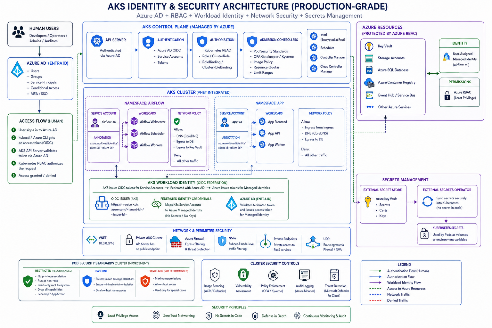

This is one of the most important modern AKS security architectures.

If you understand:

* AKS + Azure AD
* Managed Identity
* Workload Identity

you’ll understand how **enterprise-grade authentication and authorization** works in Kubernetes on Azure.

This is heavily used in:

* Airflow on AKS
* Microservices
* CI/CD
* ML workloads
* Enterprise platform engineering

---

# 🧠 Big Picture

Problem statement:

```text id="oz6tzm"
How can:
- humans securely access AKS?
- pods securely access Azure resources?
WITHOUT storing passwords/secrets?
```

Azure solves this using:

```text id="y7xj17"
Azure AD (Entra ID)
+
Managed Identity
+
AKS Workload Identity
```

---

# 🏗️ High-Level Architecture

```text id="3dzm6o"
Developer
    │
    ▼
Azure AD Authentication
    │
    ▼
AKS API Server
    │
    ▼
RBAC Authorization


Pods
    │
    ▼
Kubernetes Service Account
    │
    ▼
Federated Identity Credential
    │
    ▼
Azure Managed Identity
    │
    ▼
Azure Resources
(Key Vault, Blob, SQL, etc.)
```

---

# 🔹 PART 1 — AKS + Azure AD (Human Authentication)

This secures:

* Engineers
* Admins
* DevOps users

---

# 🧠 Traditional Problem

Old Kubernetes clusters used:

* static kubeconfig
* admin certificates

Problems:
❌ shared credentials
❌ no MFA
❌ poor auditing
❌ no centralized identity

---

# ✅ Modern Solution

Use:

> Azure AD (Microsoft Entra ID)

---

# 🔥 Authentication Flow

```text id="r6tmhc"
Engineer
   │
kubectl get pods
   │
   ▼
Azure AD login
   │
   ▼
AKS validates token
   │
   ▼
RBAC checks permissions
   │
   ▼
Access granted/denied
```

---

# 🔹 What Happens Practically?

---

## Step 1: User Logs In

```bash id="zzg12z"
az login
```

---

## Step 2: Get AKS Credentials

```bash id="1uduxv"
az aks get-credentials \
  --resource-group prod-rg \
  --name prod-aks
```

---

## Step 3: kubectl Uses Azure AD Token

```bash id="c2q5x0"
kubectl get pods
```

AKS API server validates:

* identity
* token
* group membership

---

# 🔥 Benefits

✅ MFA
✅ Conditional Access
✅ Centralized identity
✅ SSO
✅ Auditing
✅ Easy offboarding

---

# 🔹 Production Best Practice

NEVER use:

```text id="3hzy3u"
cluster-admin for everyone
```

Instead:

* Azure AD Groups
* RBAC mappings

---

# 🧩 Example

| Team          | Permissions            |
| ------------- | ---------------------- |
| Developers    | Namespace-level access |
| Platform Team | Cluster admin          |
| Security Team | Read-only auditing     |

---

# 🔹 PART 2 — Kubernetes RBAC with Azure AD

Azure AD handles:

```text id="9k9xig"
Authentication
```

Kubernetes RBAC handles:

```text id="tpkbrf"
Authorization
```

---

# 🧪 Example RBAC

---

## Role

```yaml id="3ty5w0"
kind: Role
metadata:
  namespace: airflow

rules:
- apiGroups: [""]
  resources: ["pods"]
  verbs: ["get", "list"]
```

---

## RoleBinding to Azure AD Group

```yaml id="q70rmg"
kind: RoleBinding
metadata:
  name: airflow-readers

subjects:
- kind: Group
  name: airflow-dev-team

roleRef:
  kind: Role
  name: pod-reader
```

---

# 🔥 Result

Members of:

```text id="s1v4sl"
airflow-dev-team
```

can:
✅ read pods
❌ delete deployments

---

# 🔹 PART 3 — Managed Identity (Azure Identity for Resources)

Now workload identity.

---

# 🧠 Traditional Problem

Pods needing Azure access often used:

* client secrets
* service principal passwords

Problems:
❌ secret rotation
❌ credential leakage
❌ hardcoded secrets

---

# ✅ Modern Azure Solution

Use:

> Managed Identity

---

# 🧠 What is Managed Identity?

Azure automatically creates:

> an Azure identity for workloads

No passwords needed.

---

# 🧩 Example

Your Airflow pod needs:

* Key Vault access
* Blob Storage access

Instead of password:

```text id="gxfte0"
Pod gets Azure identity
```

---

# 🔥 Types of Managed Identity

| Type            | Scope        |
| --------------- | ------------ |
| System-assigned | One resource |
| User-assigned   | Reusable     |

---

# Production Recommendation

Use:

> User-assigned managed identity

More flexible.

---

# 🔹 PART 4 — AKS Workload Identity (VERY IMPORTANT)

This is the MODERN secure approach.

---

# 🧠 What is Workload Identity?

Maps:

```text id="wl6s3s"
Kubernetes Service Account
        ↓
Azure Managed Identity
```

WITHOUT secrets.

---

# 🔥 Key Insight

Pods authenticate to Azure using:

* OIDC federation
* short-lived tokens
* no secrets

---

# 🏗️ Production Flow

```text id="o1zy4n"
Pod
 │
 ▼
Kubernetes Service Account
 │
 ▼
OIDC Token
 │
 ▼
Azure AD Federated Credential
 │
 ▼
Managed Identity
 │
 ▼
Azure Resource Access
```

---

# 🔹 Real Example

Airflow Worker Pod:

* reads secrets from Key Vault
* uploads logs to Blob Storage

WITHOUT:
❌ passwords
❌ client secrets
❌ certificates

---

# 🔥 Why This Is Huge

This is:

> cloud-native identity

---

# 🔹 Workload Identity Setup (Conceptual)

---

# Step 1: Create Managed Identity

```bash id="79eqof"
az identity create \
  --name airflow-mi
```

---

# Step 2: Enable OIDC on AKS

```bash id="c6xj25"
az aks update \
  --enable-oidc-issuer \
  --enable-workload-identity
```

---

# Step 3: Create Federated Credential

Links:

```text id="jlwmfi"
ServiceAccount ↔ Managed Identity
```

---

# Step 4: Kubernetes Service Account

```yaml id="r5grz3"
apiVersion: v1
kind: ServiceAccount
metadata:
  name: airflow-sa
  annotations:
    azure.workload.identity/client-id: <managed-identity-client-id>
```

---

# Step 5: Pod Uses Service Account

```yaml id="j3prf9"
spec:
  serviceAccountName: airflow-sa
```

---

# 🔥 Result

Pod automatically gets Azure identity.

---

# 🔹 Accessing Azure Resources

---

# Example: Key Vault

Assign RBAC:

```text id="6y8hcu"
Managed Identity
    ↓
Key Vault Secrets User Role
```

Now pod can:

```text id="psqfyi"
read secrets securely
```

---

# 🧠 Real Production Example

---

# Airflow Architecture

```text id="x5uxmq"
Airflow Webserver
Airflow Scheduler
Airflow Workers
        │
        ▼
Workload Identity
        │
        ▼
Azure Key Vault
Azure Blob Storage
Azure SQL
```

No secrets inside Kubernetes.

---

# 🔥 Why Enterprises Love This

---

## ✅ No secret rotation headaches

---

## ✅ Centralized Azure IAM

---

## ✅ Auditing in Azure

---

## ✅ Least privilege access

---

## ✅ Zero-trust identity model

---

# 🔹 PART 5 — Azure RBAC vs Kubernetes RBAC

Very important distinction.

---

# Azure RBAC

Controls:

```text id="y84xsz"
Azure resources
```

Examples:

* Key Vault
* Storage
* AKS resource itself

---

# Kubernetes RBAC

Controls:

```text id="2f48s8"
Kubernetes API resources
```

Examples:

* pods
* deployments
* secrets

---

# 🧠 Example

| Action              | RBAC Type       |
| ------------------- | --------------- |
| Read pods           | Kubernetes RBAC |
| Access Blob Storage | Azure RBAC      |
| Modify AKS cluster  | Azure RBAC      |
| Create deployment   | Kubernetes RBAC |

---

# 🔹 PART 6 — Production Architecture

---

```text id="5wkrz0"
                Developers / DevOps
                         │
                         ▼
                  Azure AD Login
                         │
                         ▼
                  AKS API Server
                         │
                  Kubernetes RBAC
                         │
 ┌───────────────────────┴───────────────────────┐
 ▼                                               ▼

Namespace: airflow                         Namespace: platform

Airflow Pods                               Monitoring Pods
     │                                           │
     ▼                                           ▼
Kubernetes Service Account              Kubernetes Service Account
     │                                           │
     ▼                                           ▼
Azure Workload Identity                Azure Workload Identity
     │                                           │
     ▼                                           ▼
Managed Identity                        Managed Identity
     │                                           │
     ▼                                           ▼
Azure Key Vault                         Azure Monitor
Azure Blob Storage                      Log Analytics
Azure SQL
```

---

# 🔥 Security Best Practices

---

# ✅ Use Azure AD Integration

Never static admin credentials.

---

# ✅ Use Namespace-level RBAC

Least privilege.

---

# ✅ Use Workload Identity

Avoid secrets.

---

# ✅ Use User-assigned Managed Identity

Reusable and scalable.

---

# ✅ Use Key Vault

Avoid storing secrets in Kubernetes.

---

# ✅ Disable Local Accounts

Production AKS recommendation.

---

# 🔥 Common Beginner Mistakes

---

## ❌ Using service principal secrets

Old insecure model.

---

## ❌ Using cluster-admin everywhere

Massive risk.

---

## ❌ Hardcoding Azure credentials

Very dangerous.

---

## ❌ Using default service account

Bad practice.

---

# 🧠 Final Mental Model

| Component         | Responsibility                  |
| ----------------- | ------------------------------- |
| Azure AD          | Human identity                  |
| Kubernetes RBAC   | Kubernetes permissions          |
| Managed Identity  | Azure workload identity         |
| Workload Identity | Pod ↔ Azure identity federation |
| Key Vault         | Secure secret storage           |

---

# 🔥 One-Line Summary

> AKS + Azure AD + Workload Identity enables secure, passwordless, cloud-native identity and authorization for both humans and Kubernetes workloads in production.

---

The architecture diagram could be as below:

