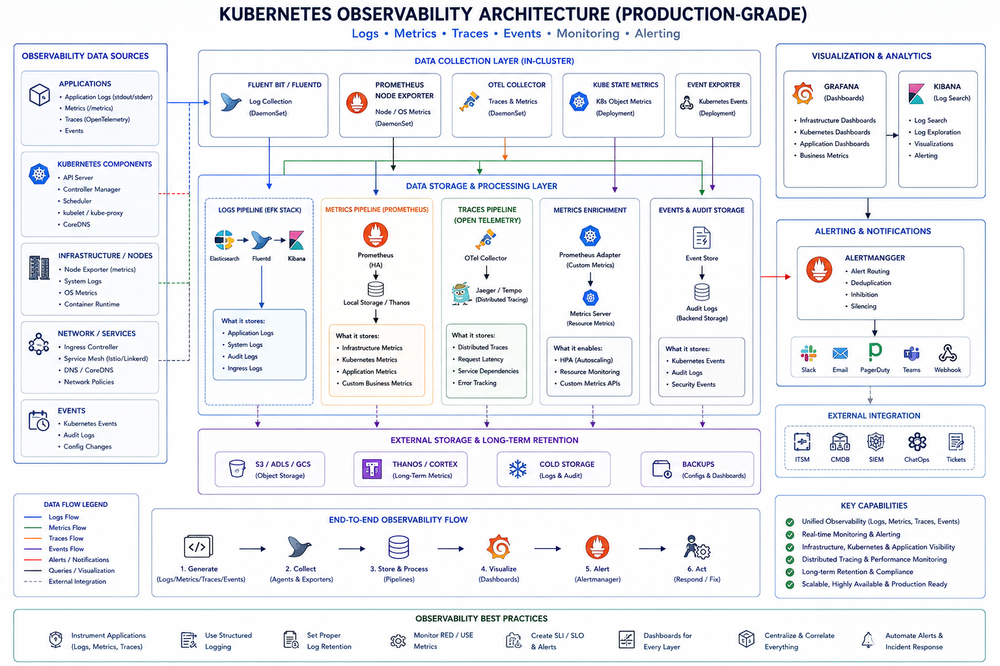

Until now, you learned:

* how to deploy systems
* networking
* security
* workloads

Now the question becomes:

```text id="nd2u7r"
How do you KNOW what is happening inside the cluster?
```

This phase is about:

* troubleshooting
* visibility
* metrics
* debugging
* production operations

This is the “SRE/DevOps mindset” phase.

---

# 🔭 PHASE 7: Observability & Debugging

---

# 🧠 Big Picture

Production Kubernetes clusters are dynamic:

* Pods restart
* Nodes fail
* Traffic spikes
* Containers crash
* Services become unhealthy

You need visibility into:

* logs
* events
* metrics
* health
* resource usage

---

# 🧩 Observability Stack

```text id="7oqexm"
Application
    │
    ▼
Logs + Metrics + Events
    │
    ▼
Monitoring & Alerting
    │
    ▼
Debugging & Incident Response
```

---

# 🔹 1. kubectl Deep Dive

`kubectl` is your primary operational tool.

Think of it as:

> SSH + Docker CLI + Cluster API client combined

---

# 🧠 Most Important kubectl Commands

---

# 🔹 Get Resources

```bash id="fghgq6"
kubectl get pods
```

---

# 🔹 Wide Output

```bash id="dhgt6u"
kubectl get pods -o wide
```

Shows:

* IPs
* nodes
* status

---

# 🔹 Describe Resource

VERY IMPORTANT.

```bash id="m36h9r"
kubectl describe pod mypod
```

Shows:

* events
* scheduling
* probes
* container state
* restart reasons

---

# 🔥 This is one of the MOST used commands in production.

---

# 🔹 View YAML

```bash id="by6zvf"
kubectl get deployment api -o yaml
```

---

# 🔹 Apply Changes

```bash id="7qfrsq"
kubectl apply -f deployment.yaml
```

---

# 🔹 Edit Live Resource

```bash id="qq6v3v"
kubectl edit deployment api
```

---

# 🔹 Delete Resource

```bash id="40g0xm"
kubectl delete pod mypod
```

---

# 🔹 Exec Into Pod

```bash id="4eh4ff"
kubectl exec -it mypod -- /bin/sh
```

Equivalent to:

```text id="zflmrf"
SSH into container
```

---

# 🔹 Port Forward

Very useful debugging command.

```bash id="c2pm93"
kubectl port-forward svc/grafana 3000:80
```

---

# 🔹 Logs

```bash id="q1ktzq"
kubectl logs mypod
```

---

# 🔹 Follow Logs

```bash id="6m9r3w"
kubectl logs -f mypod
```

---

# 🔹 Previous Crashed Container Logs

VERY IMPORTANT.

```bash id="6x9yxw"
kubectl logs mypod --previous
```

---

# 🔹 Top Resource Usage

Needs Metrics Server.

```bash id="jlwm3g"
kubectl top pods
kubectl top nodes
```

---

# 🔥 Production Debugging Flow

Usually:

```text id="t9j5ja"
kubectl get pods
      ↓
kubectl describe pod
      ↓
kubectl logs
      ↓
kubectl exec
```

---

# 🔹 2. Logs & Events

This is foundational observability.

---

# 🧠 Logs

Application-generated output.

Examples:

* errors
* stack traces
* API logs

---

# 🔥 Kubernetes Best Practice

Applications should log to:

```text id="8v4u6w"
stdout/stderr
```

NOT local files.

Why?
Because Kubernetes captures container logs automatically.

---

# 🧪 Example

```bash id="mlls3h"
kubectl logs api-pod
```

---

# 🧠 Events

Cluster-generated activity.

Examples:

* pod scheduled
* image pull failed
* probe failed
* node pressure

---

# 🧪 View Events

```bash id="abgt8v"
kubectl get events
```

---

# 🔥 Very Important

Many production issues are visible ONLY in events.

---

# 🧪 Example Event

```text id="4uc2x8"
FailedScheduling:
0/3 nodes available
```

Meaning:

* insufficient CPU/memory

---

# 🔹 3. Debugging Pods

One of the most critical production skills.

---

# 🧠 Common Pod Problems

| Problem          | Symptoms               |
| ---------------- | ---------------------- |
| CrashLoopBackOff | App crashes repeatedly |
| ImagePullBackOff | Cannot pull image      |
| Pending          | Scheduling issue       |
| OOMKilled        | Out of memory          |
| Probe failures   | Restarting containers  |

---

# 🔥 Debugging Workflow

---

# Step 1: Check Pods

```bash id="hkmifm"
kubectl get pods
```

---

# Step 2: Describe Pod

```bash id="12k2u7"
kubectl describe pod api-pod
```

---

# Step 3: View Logs

```bash id="q0a6ea"
kubectl logs api-pod
```

---

# Step 4: Exec into Container

```bash id="ynv5kt"
kubectl exec -it api-pod -- sh
```

---

# 🔥 Real Examples

---

# CrashLoopBackOff

Usually:

* app startup failure
* missing env vars
* DB connection issue

---

# ImagePullBackOff

Usually:

* wrong image
* auth issue
* registry problem

---

# Pending

Usually:

* insufficient resources
* taints/tolerations
* PVC unavailable

---

# OOMKilled

Container exceeded memory limit.

---

# 🧠 Production Debugging Mental Model

```text id="z3wwd8"
Container issue?
→ logs

Cluster issue?
→ events

Networking issue?
→ exec + curl

Scheduling issue?
→ describe pod
```

---

# 🔹 4. Monitoring

Now metrics.

---

# 🧠 Why Monitoring Matters

Need visibility into:

* CPU
* memory
* latency
* traffic
* errors

---

# 🔹 Metrics Server

Basic Kubernetes metrics provider.

---

# Provides

```text id="ig9tjl"
kubectl top pods
kubectl top nodes
```

---

# Used by

```text id="1h9iqn"
Horizontal Pod Autoscaler (HPA)
```

---

# 🧪 Example

```bash id="2h18vb"
kubectl top pods
```

Output:

```text id="aq04z5"
api-pod   120m CPU   300Mi memory
```

---

# ⚠️ Limitation

Metrics Server is:

* lightweight
* basic

NOT full observability.

---

# 🔹 Prometheus (VERY IMPORTANT)

Industry-standard Kubernetes monitoring.

---

# 🧠 What Prometheus Does

Collects:

* metrics
* time-series data

From:

* nodes
* pods
* kubelet
* applications

---

# 🧩 Example Metrics

```text id="rsvkj1"
CPU usage
Memory usage
HTTP request count
API latency
Error rates
```

---

# 🔥 Architecture

```text id="pup7zc"
Pods/Nodes
    ↓
Prometheus scrapes metrics
    ↓
Stores time-series DB
```

---

# 🧪 Example

Application exposes:

```text id="z3svm9"
/metrics
```

Prometheus periodically scrapes it.

---

# 🔹 Grafana

Visualization layer.

---

# 🧠 Purpose

Turns metrics into:

* dashboards
* charts
* alerts

---

# 🧪 Real Dashboard

Shows:

* CPU trends
* pod restarts
* latency
* node usage

---

# 🧠 Production Stack

```text id="mqqo3o"
Prometheus → stores metrics
Grafana → visualizes metrics
Alertmanager → sends alerts
```

---

# 🔥 Real Production Flow

```text id="s0kk5l"
Cluster issue
    ↓
Prometheus detects
    ↓
Grafana dashboard updates
    ↓
Alertmanager sends Slack/PageDuty alert
```

---

# 🔹 5. Health Checks (VERY IMPORTANT)

Critical production concept.

---

# 🧠 Problem

How does Kubernetes know:

* app healthy?
* app ready for traffic?

---

# Solution:

> Probes

---

# 🔹 Liveness Probe

Answers:

> “Is application alive?”

---

# If liveness fails:

```text id="n8uyvy"
Kubernetes restarts container
```

---

# 🧪 Example

```yaml id="3f20zs"
livenessProbe:
  httpGet:
    path: /health
    port: 8080

  initialDelaySeconds: 10
  periodSeconds: 5
```

---

# 🔥 Use Case

Detect:

* deadlocks
* hung applications
* frozen processes

---

# 🔹 Readiness Probe

Answers:

> “Can app receive traffic?”

---

# If readiness fails:

```text id="fnulbg"
Pod removed from Service endpoints
```

BUT:

```text id="1j74xb"
container NOT restarted
```

---

# 🧪 Example

```yaml id="ngvf9o"
readinessProbe:
  httpGet:
    path: /ready
    port: 8080
```

---

# 🔥 Important Insight

App may be:

* alive
* but NOT ready

Example:

```text id="yng1t2"
still connecting to database
```

---

# 🔹 Startup Probe

For slow-starting apps.

Prevents premature restarts.

---

# 🧠 Probe Flow

```text id="0ag0sn"
Startup Probe
      ↓
Readiness Probe
      ↓
Liveness Probe
```

---

# 🔥 Real Production Example

Spring Boot app:

* startup takes 60 sec

Without startup probe:

```text id="o5h12c"
Kubernetes kills app repeatedly
```

---

# 🔹 Real Production Observability Architecture

```text id="5iq4a0"
                Kubernetes Cluster
 ┌────────────────────────────────────────────┐
 │                                            │
 │  Pods                                      │
 │   ├── Application Logs                     │
 │   ├── Metrics (/metrics)                   │
 │   ├── Liveness Probe                       │
 │   └── Readiness Probe                      │
 │                                            │
 └────────────────────────────────────────────┘
                    │
        ┌───────────┼───────────┐
        ▼                       ▼

   Prometheus               kubectl/logs/events
        │
        ▼
   Grafana Dashboards
        │
        ▼
   Alertmanager
        │
        ▼
 Slack / PagerDuty / Email
```

---

# 🔥 Common Beginner Mistakes

---

## ❌ No readiness probes

Traffic goes to broken pods.

---

## ❌ Aggressive liveness probes

Pods restart endlessly.

---

## ❌ No resource monitoring

Cluster instability.

---

## ❌ Logging to local files

Logs lost when pod dies.

---

## ❌ No centralized monitoring

Impossible debugging.

---

# 🧠 Production Best Practices

---

## Logging

✅ stdout/stderr
✅ centralized logging

---

## Metrics

✅ Prometheus + Grafana

---

## Health Checks

✅ readiness + liveness + startup probes

---

## Alerts

✅ CPU/memory/error alerts

---

## Debugging

✅ events + logs + metrics correlation

---

# 🧠 Final Mental Model

| Component       | Purpose                 |
| --------------- | ----------------------- |
| kubectl         | Operational interface   |
| Logs            | Application behavior    |
| Events          | Cluster behavior        |
| Metrics Server  | Basic metrics           |
| Prometheus      | Metrics collection      |
| Grafana         | Visualization           |
| Liveness Probe  | Restart unhealthy app   |
| Readiness Probe | Control traffic routing |

---

# 🔥 One-Line Summary

> Observability in Kubernetes is about understanding application health, cluster behavior, resource usage, and failures using logs, events, metrics, probes, and monitoring systems.

---


The architectural diagram:

